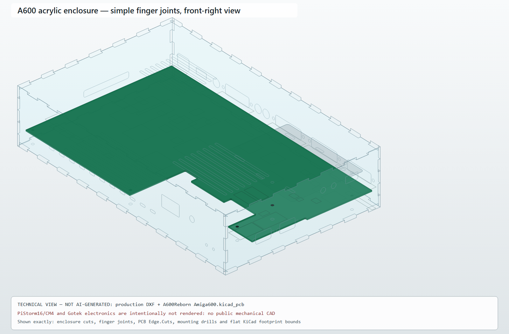
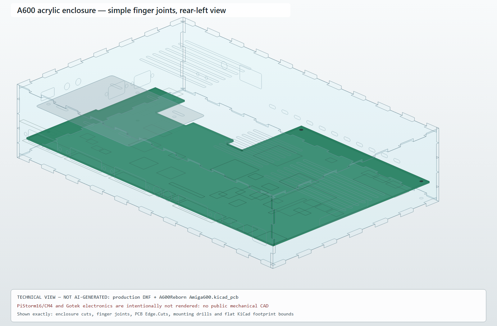
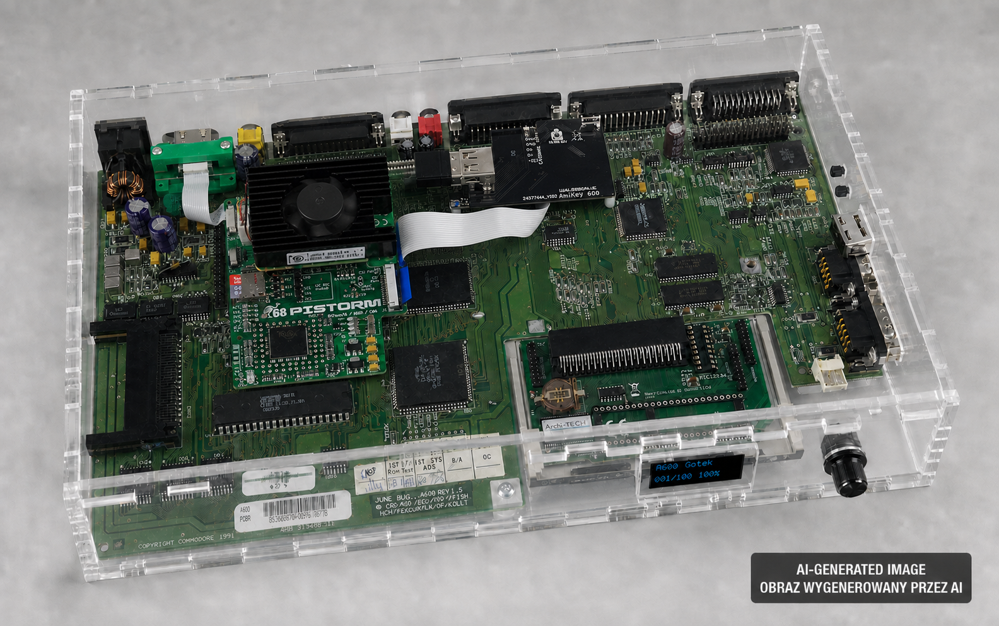

# Obudowa plexi A600Reborn + PiStorm16 CM4

[English version](README.md)

Zestaw płaskich paneli CNC dla płyty Amiga 600 zgodnej z projektem
[A600Reborn](https://github.com/istedman/A600Reborn), PiStorm16/CM4 z aktywnym
chłodzeniem, dolnego rozszerzenia 1 MB Chip RAM oraz FrameThrower 600. Wyjście
obrazu stanowi pełnowymiarowe HDMI na taśmie i uchwycie montowanym w miejscu
modulatora RF.

> **Status: prototyp mechaniczny.** Geometria płyty i złączy pochodzi z KiCad,
> ale uchwyt HDMI, Gotek Ami64 i konkretne chłodzenie CM4 nie mają publicznych
> rysunków wykonawczych. Przed cięciem docelowej plexi wykonaj próbny panel I/O
> z HDF lub kartonu 1 mm i sprawdź wymiary opisane niżej.

## Zawartość repozytorium

```text
.
├── dxf_screws/          wariant skręcany, pliki CNC w skali 1:1
├── dxf_simple_joinery/  prosty wariant finger-joint w stylu Bramble Pi
├── generate_dxf.py      parametryczny generator bez zależności zewnętrznych
├── visualize_assembly.py deterministyczny rzut 3D z DXF i KiCad
├── renders/             wygenerowane widoki SVG i PNG
├── .gitignore
├── README.md            dokumentacja angielska
└── CZYTAJTO.md          dokumentacja polska
```

Pliki w `dxf_screws/` są celowo przechowywane w repozytorium, żeby można było wysłać
je do wykonawcy bez instalowania Pythona. Po zmianie parametrów wygeneruj je
ponownie poleceniem:

```powershell
python generate_dxf.py
```

Wizualizacje techniczne w `renders/` są generowane deterministycznie z DXF i
źródłowego PCB — nie przez generator obrazów. Aby odtworzyć oba widoki:

```powershell
python visualize_assembly.py --pcb C:\ścieżka\do\Amiga600.kicad_pcb
```

Polecenie odtwarza oba widoki obudowy finger-joint.





> **Informacja o AI:** Poniższy koncepcyjny obraz fotorealistyczny został
> wygenerowany przez AI na podstawie dostarczonego zdjęcia złożonej A600.
> Oznaczenie jest widoczne bezpośrednio na obrazie, zgodnie z zasadą
> przejrzystości opisaną w
> [ramach regulacyjnych AI Komisji Europejskiej](https://digital-strategy.ec.europa.eu/pl/policies/regulatory-framework-ai).



Obraz wygenerowany przez AI jest wyłącznie ilustracją; przy wymiarowaniu i
produkcji należy korzystać z niegenerowanych przez AI widoków SVG oraz plików
DXF.

Skrypt pokazuje wyłącznie geometrię potwierdzoną w DXF/KiCad. Obrys PCB
`Edge.Cuts`, średnice otworów montażowych i płaskie granice footprintów są
odczytywane bezpośrednio z pliku KiCad. Nie są nadawane umowne wysokości
elementów. PiStorm16/CM4 i elektronika Goteka są świadomie pominięte, ponieważ
nie ma ich publicznych rysunków mechanicznych; nie są zastępowane wymyślonymi
modelami.

## Pliki do produkcji

W katalogu `dxf_screws/` znajduje się wariant skręcany:

- `01_bottom_3mm.dxf` — dno, pięć punktów montażowych PCB i nawiew pod RAM;
- `01b_bottom_gotek_3mm.dxf` — zgodne dno wariantu Gotek; nośnik korzysta z
  osi dystansów płyty H1/MT6, więc nie wymaga dodatkowych otworów w dnie;
- `02_top_3mm.dxf` — góra, nawiew PiStorm16 i wylot po przeciwnej stronie;
- `02b_top_gotek_oled_rotary_3mm.dxf` — góra z OLED-em 0,96 cala,
  enkoderem i diodą aktywności;
- `02c_top_gotek_external_box_3mm.dxf` — góra z dwoma przepustami taśm,
  zgodna z zewnętrznym pudełkiem dostarczanym przez Ami64;
- `02d_top_gotek_carrier_above_cn11_3mm.dxf` — pełna góra dla Goteka
  zamontowanego nad CN11 na dystansach płyty;
- `03_rear_io_1mm.dxf` — zasilanie, HDMI, composite, RGB, audio, serial,
  parallel i external floppy;
- `04_right_io_3mm.dxf` — dwa porty joystick/mouse DE-9;
- `04b_right_io_floppy_3mm.dxf` — alternatywa z ogólnym otworem napędu;
- `04c_right_io_gotek_usb_3mm.dxf` — panel Goteka z USB-A w tylnej strefie
  oraz dwoma otworami 6,5 mm na przyciski sterujące;
- `05_left_pcmcia_3mm.dxf` — PCMCIA;
- `06_front_3mm.dxf` — front z wentylacją i dwiema diodami 3 mm;
- `06b_front_gotek_oled_rotary_3mm.dxf` — front z OLED-em 0,96 cala i
  enkoderem;
- `07_gotek_carrier_3mm.dxf` — uniwersalny regulowany nośnik PCB Goteka.

DXF jest w formacie ASCII AutoCAD R12, jednostki: **mm**, skala **1:1**. Każdy
plik produkcyjny zawiera wyłącznie zamknięte kontury na warstwie `CUT`. Nie ma
kompensacji średnicy frezu — operator CAM powinien ustawić ją po właściwej
stronie konturu.

Wszystkie otwory Ø3,4 mm pod M3 są **otworami przelotowymi**, a nie gwintami.
Plexi 1 mm ani 3 mm nie utrzyma pewnie gwintu M3. Należy stosować śruby
przelotowe z nakrętkami i podkładkami, gwintowane dystanse metalowe/nylonowe
albo kostki narożne. Nie wolno wkręcać M3 bezpośrednio w plexi. Panel tylny
1 mm wymaga również podkładek rozkładających nacisk i podparcia kątownikiem
lub dystansem; nie należy go pogłębiać pod łeb stożkowy.

## Wymiary i montaż

- gabaryt zewnętrzny płyt poziomych: 329 × 206 mm;
- wysokość paneli pionowych: 72 mm;
- góra, dół i boki: plexi 3 mm;
- tył I/O: PETG/poliwęglan 1 mm jest bezpieczniejszy od kruchej plexi 1 mm;
- spód PCB: 18 mm nad dnem, dystanse nylonowe M3;
- płyty góra/dół: cztery dystanse narożne M3, długość 72 mm;
- otwory w H1–H3: śruba M3 bez naprężania PCB;
- otwory MT5–MT6: śruba M3 z podkładką izolacyjną.

Nie użyto MT1–MT4: na PCB są to szczeliny 3,75 × 1,50 mm, a nie otwory pod
M3. MT7 nie ma przewiercenia. Pięć zastosowanych punktów daje stabilne podparcie
bez przerabiania płyty.

Dostępne są wersje zwykła, aktualna z OLED-em/enkoderem we froncie oraz starsze
warianty prowadzenia przewodów przez pokrywę. Nośnik Goteka
`dxf_screws/07_gotek_carrier_3mm.dxf` jest wspólny dla wszystkich sposobów łączenia.

## Proste połączenia finger-joint

Katalog `dxf_simple_joinery/` zawiera prostszą wersję wzorowaną na
[obudowie BRAMBLE Pi](https://www.tindie.com/products/Nick/bramble-pi-raspberry-pi-case/).
Sześć płyt łączy się bez dodatkowych klinów: prostokątne palce na każdej
krawędzi wchodzą bezpośrednio w komplementarne wycięcia sąsiedniej płyty.
Zachowano wszystkie otwory I/O oraz zwykłe i oba warianty Goteka.

Wszystkie ściany, łącznie z tylną, są przeznaczone na arkusz **3 mm**. Palce
mają około 16 mm szerokości, a generator dodaje 0,12 mm całkowitego luzu na
parę palec–wycięcie (`SIMPLE_FINGER_CLEARANCE`). Jest to wartość startowa:
przed cięciem kompletu wykonaj próbę na kilku palcach z tego samego arkusza i
dopasuj luz do rzeczywistego kerfu. Ostre narożniki są przeznaczone przede
wszystkim do lasera; przy frezowaniu trzeba dodać dog-bones w CAM.

Orientacja panelu tylnego jest podana względem użytkownika stojącego przed
Amigą: gniazdo zasilania znajduje się po lewej stronie (mała współrzędna X).

### Wariant Gotek Ami64 OLED + Rotary

Aktualny układ używa paneli `01`, `02d`, `04c`, `06b` i nośnika `07`. Nośnik
Goteka znajduje się nad złączem floppy CN11 w prawym tylnym obszarze płyty.
Jest przykręcony na dłuższych nylonowych dystansach współosiowych z punktami
montażowymi motherboardu H1 i MT6; pokrywa i dno nie dostają osobnych otworów.
OLED 0,96 cala oraz enkoder są zamontowane w prawej części panelu przedniego.

Okno OLED ma 28 × 15 mm, a otwór tulei enkodera 7,5 mm. Panel `04c` ma w tylnej
części prawego boku otwór USB-A 16,5 × 8,5 mm i dwa otwory 6,5 mm na przyciski,
z dala od gniazd DE-9.
Nośnik 120 × 95 mm ma podłużne otwory pozwalające dopasować różne rewizje PCB.
Ponieważ dołączony uchwyt Ami64 jest drukowany 3D, a producent nie publikuje
jego rysunku wykonawczego, przed CNC należy porównać otwory z posiadanym
egzemplarzem i potwierdzić wysokość dystansów nad elementami płyty.

Panele pionowe wariantu skręcanego najlepiej łączyć z płytami kątownikami
15 × 15 mm albo kostkami drukowanymi 3D. Otwory narożne Ø3,4 mm są wyłącznie
przelotowe; nakrętka lub gwint musi znajdować się w kątowniku/dystansie, nigdy
w plexi 1 lub 3 mm. Nie kleić boków przed próbnym złożeniem i sprawdzeniem
wtyków D-sub.

## HDMI i FrameThrower

Projekt zakłada zestaw Archi-TECH: pełne HDMI na PCB, taśma flex, mini-HDMI i
drukowany uchwyt mocowany w miejscu RF. Panel ma otwór 16,0 × 7,5 mm ze środkiem
zgodnym z położeniem X2/RF projektu A600Reborn. Uchwyt pozostaje przykręcony do
płyty; cienki panel tylny pełni tylko rolę maskownicy. FrameThrower 600 zakłada
się na Denise i łączy z PiStorm przez CSI — nie wymaga osobnego otworu.

## Ważne przed frezowaniem

Geometria płyty i portów pochodzi ze źródłowego `Amiga600.kicad_pcb`. Mechanika
konkretnego napędu dyskietek, uchwytu HDMI i wariantu rozszerzenia RAM nie jest
opublikowana jako rysunek wymiarowy. Dlatego najpierw wykonaj próbny tył z
kartonu/HDF 1 mm i sprawdź:

1. wysokość osi złączy — projekt: 26,6 mm od dolnej krawędzi panelu;
2. otwór HDMI 16,0 × 7,5 mm i jego środek;
3. czy RAM ma co najmniej 15 mm luzu pod PCB;
4. położenie szczeliny napędu przed użyciem wariantu `04b`.
5. położenie USB i średnicę gwintowanej tulei enkodera przed użyciem `02b/04c`.

Jeżeli pomiar różni się od założenia, zmień `PCB_Z`, `IO_Z` albo parametry
danego otworu w `generate_dxf.py` i uruchom `python generate_dxf.py`.

## Źródła wymiarów

- [A600Reborn](https://github.com/istedman/A600Reborn), plik KiCad i footprinty
  złączy: obrys 316,992 × 194,056 mm;
- H1 `(311,912; 22,352)`, H2 `(5,080; 188,976)`, H3
  `(282,956; 150,622)`, MT5 `(158,496; 187,960)`, MT6
  `(274,066; 96,393)` — współrzędne względem PCB;
- [PiStorm16 CM4](https://programatory.archi-tech.com.pl/pl/p/Pistorm16-RPi-CM4-Gotowy-do-pracy/359)
  — aktywne chłodzenie oraz HDMI na taśmie;
- [uchwyt HDMI zamiast RF](https://programatory.archi-tech.com.pl/pl/p/Mocowanie-portu-HDMI-w-miejscu-modulatora-Amiga-600/354);
- [FrameThrower 600](https://programatory.archi-tech.com.pl/pl/p/Framethrower-600-FT600-Pistorm/375)
  — montaż na Denise i połączenie CSI;
- [Gotek Ami64 OLED + Rotary](https://www.ami64.com/product-page/internal-amiga-a600-gotek-with-oled-rotary)
  — wewnętrzny emulator stacji oraz zewnętrzny OLED 0,96 cala z enkoderem.

## Uwagi produkcyjne

- frez powinien wejść od strony odpadu; DXF nie zawiera kompensacji narzędzia;
- dla plexi stosuj frez jednopiórowy do tworzyw i nie zdejmuj folii ochronnej;
- panel tylny 1 mm lepiej wykonać z PETG lub poliwęglanu niż kruchego PMMA;
- śruby przy PCB powinny być nylonowe albo mieć podkładki izolacyjne;
- nie podłączaj dodatkowego zasilacza do Raspberry Pi/PiStorm równolegle z
  zasilaniem Amigi.
